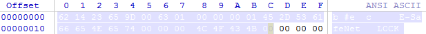

# reverseCDGencryption

### 用途

对被亿赛通透明加密的文件进行解密。

### 使用方法

1. 将test.go与winrar.go编译成适合你系统的可执行文件。
2. 通过命令行调用winrar.go，操作方式如下：
   	- 对于解密单个文件而言：请执行`winrar.exe <test.exe的路径> <要解密的文件路径>`
   	- 对于解密当前目录所有的文件：请将winrar.exe放入要解密的目录，并执行`winrar.exe <test.exe的路径> `

### 运行原理

通过具有读取加密文件权限的白名单软件作为代理，获取到未经加密的文件信息，再将其另存为解密后的文件（修改扩展名防止被再次加密）。

### 一个小脚本为什么选择golang，Python不好吗？

在测试&生产环境中，读取已加密文件的权限是那个该死的CDG管理软件按照进程名称给的，python写的脚本获取不到这个权限。

### 为什么两个程序的名称一个是winrar，一个是test呢？

经测试，winrar.exe在进程白名单上，且具有打开多种已加密文件格式的授权（这玩意授权居然还分软件的，比如名为word.exe的进程就打不开.xslx后缀的文件）。

test.go是一个用于检测文件头中是否有被加密痕迹（如图所示）的模块，所以需要其不在上述白名单上。

### 结语

被这玩意烦透了，代码都给你加密成二进制导致编译失败。
